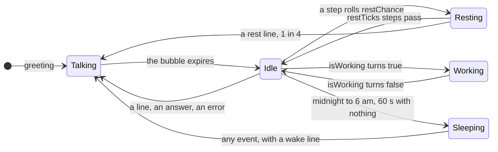

# Engine

The engine decides what the band above the prompt shows at every moment: where the character stands, which pose and frame it draws, what it says, and what floats above it.
It is a pure state machine, the brain, fed by Claude Code's events and one clock, and drawn by the adapter.

## The band

Claude Code raises `ui.render` for the `AbovePrompt` site on every draw of the line above the prompt, in the terminal and the desktop app (VS Code and mobile never raise it, and buddy does not work around that).
The adapter's hook reads four props and either draws or yields:

| Prop | Use |
| --- | --- |
| `hasSurvey` | a survey owns the line: buddy returns `next(e)` and draws nothing |
| `bodyColumns` | the width the scene is laid out in |
| `maxRows` | the height available for confetti or the sleep drift above the sprite |
| `isWorking` | Claude is working: the brain switches to the `working` pose |

Hidden (`/buddy off`) or not yet started, the hook also yields.
Otherwise it reports the props to the brain (`observeBand`), asks for the scene (`sceneOf`), and maps the `Scene` to `Box` and `Text` one to one (`drawBand`).
A scene is plain data: the sprite's rows and color, its column, the bubble, the effect rows above it, and the hover card.
Below `width + 2` columns there is no scene and the hook yields.

The scene's JSON is also the redraw key.
After any event the adapter computes the scene and calls `$.ui.invalidate('ui.render')` only when that JSON differs from the one last drawn, so a character standing still costs no redraws.

## The tick

One timer drives everything: `$.clock.every(period, onTick)`.
The period is the character's `motion.stepMs` when it walks, else `STILL_PERIOD_MS` (300 ms); a switch to a character with another period restarts the timer.
`/buddy off` stops it and `/buddy on` starts it again, so a hidden buddy costs nothing.

Each tick advances the brain's own clock, `b.now`, by exactly one period, then expires the bubble and the confetti, checks for sleep, and moves the character.
Brain time is the tick count times the period, never the wall clock, so a test that advances the clock by N ms sees exactly N ms of behaviour.
The one exception is sleep, which asks the wall-clock hour.
A tick that throws is logged once, and again only when the message changes, so a broken tick cannot flood the log.

## Motion

`tickMotion` in `src/motion.ts` moves the character, given whether it may walk and whether something holds it still.

- **Walk.** One column per tick. At the right edge, `cols - width - 1`, it turns; at column 0 it turns back. A narrower band pulls it in on the next tick.
- **Rest.** Every step rolls `restChance`; a hit stops it for `restTicks` steps and draws `rest`. One rest in four (`REST_LINE_CHANCE`) also says a `rest` line.
- **Held still.** A bubble, work or sleep holds it in place, and a rest's countdown waits too.
- **Frames.** Walking frames advance one per step. Every other pose changes frame every `STILL_FRAME_MS` (900 ms). A new pose starts at its first frame.
- **Standing.** Walking needs both the `motion` option and the character's `motion.walk`. Without either, the character stands on its `idle` frames and still animates.
- **Working.** When `isWorking` turns true, the brain draws `working` and stands still. Work starting wakes it; with no bubble up, one time in four (`WORKING_LINE_CHANCE`) it says a `working` line.
- **Sleep.** From midnight to 6 am local time (`isSleepHour`), after `SLEEP_IDLE_MS` (60 s) with no event, no bubble and no work, it falls asleep: the `sleep` pose and a `z Z` drift above it. Any event wakes it with a `wake` line; until one comes, it sleeps on past six.

## The brain's states

The pose drawn is a pure function of the state (`currentPose`), in this priority: the bubble's own pose, then `sleep`, then `working`, then `idle` while a pose-less bubble shows, then `rest`, then `walkRight` or `walkLeft`, then `idle`.

"Idle" is walking for a walker and standing for anyone else.
Hidden is the adapter's state, not the brain's: the band yields and the clock stops, and `/buddy on` wakes the brain and greets.

| Event | Brain function | What changes |
| --- | --- | --- |
| session start, a switch, `/buddy reload` | `setCharacter` | the new character greets (6 s); a load error shows instead (10 s) |
| `/buddy on` | `wake`, `greet` | the greeting |
| a finished tool call | `react` | wakes, adds the call to the turn's tally, reacts per the table below |
| a turn ends | `wake`, `endTurn` | the tally resets; a quip is due or not ([Voice](./voice.md)) |
| `/buddy` | `pet` | `petted` pose and line, one more pet |
| `/buddy {question}` | `beginQuestion`, then `answer` or `failAnswer` | `thinking` for up to 60 s, then the answer for 15 s, or `oops` with the reason |
| the band draws | `observeBand` | width, height, and work starting or stopping |
| a tick | `tick` | brain time, expiries, sleep, motion |

A finished tool call is classified by `classifyToolCall`, and the outcome picks a row of `REACTIONS`:

| Outcome | When | Pose | Line | Confetti |
| --- | --- | --- | --- | --- |
| `toolFail` | the call was denied, or failed without reading like a test failure | `oops` | `toolFail` | no |
| `testFail` | Bash output matches `TEST_FAIL`, and the call was not denied | `oops` | `testFail` | no |
| `testPass` | Bash output matches `TEST_PASS` and not `TEST_FAIL` | `yay` | `testPass` | yes |

Only Bash output is read for tests, and only its last 20,000 characters, where a runner prints its summary.
A failure pattern wins over a pass, and both need a non-zero count: `3 passed; 0 failed` is a pass.

## Particles

A test pass sets off two seconds (`CONFETTI_MS`) of confetti.
`particles(seed, tick, width)` is a pure function: the burst draws a seed once, and every 250 ms (`CONFETTI_TICK_MS`) the scene asks which cells are lit.
The seed feeds a small PRNG that places 4 to 14 particles, each with a start column, a delay of 0 to 2 ticks, a sideways drift of -1, 0 or 1, a glyph from `* . + o ' ,` and a hue.
A particle lives six ticks, rising one row every two ticks from the bottom of three rows to the top, and its color rotates with the tick.
The burst spans the sprite plus three columns each side, one particle per cell.
It is skipped below 40 columns (`MIN_EFFECT_COLS`) or when `maxRows` is below the sprite's height plus three.

Asleep, the same effect rows carry the `z Z` drift instead: it alternates `z Z` and `Z z` and drifts across three columns, in gray, when one row above the sprite fits.

## The speech bubble

A bubble is one line of italic text in a round-bordered box beside the sprite, `min(60, cols - width - 4)` columns wide (`bubbleWidth`).
It opens toward the free side: to the left when the sprite stands past the middle, else to the right.
When the row does not fit, the bubble pushes the sprite, and the sprite keeps the pushed column after the bubble closes, so it never jumps back.
Below 40 columns (`MIN_BUBBLE_COLS`), or when the bubble would be under 10 columns, the line is kept but not drawn.

| Bubble | Lasts |
| --- | --- |
| a canned line (`BUBBLE_MS`) | 6 s |
| a load error, a failed save (`ERROR_MS`) | 10 s |
| a model answer, or why it failed (`ANSWER_MS`) | 15 s |
| the `thinking` line while a question runs (`THINKING_MS`) | up to 60 s, until the answer replaces it |

While a bubble shows, the character stands still.
Hovering the sprite shows a card, in terminals that report the mouse: the name, the description (or an original's subtitle), `pets N | questions N | {mood}`, and an original's stat rows.
The card opens on the side away from the bubble, or not at all when neither side fits.

## Decisions

- **A pure brain, with the clock and the random source passed in.** Rejected: reading `Date.now()` and `Math.random()` inside. Passing them in lets a unit test replay any sequence exactly; the adapter passes `Math.random` and the hour.
- **Brain time advances one period per tick.** Rejected: wall-clock time. A test advances a mock clock and sees exact behaviour; the cost is that a throttled timer stretches a bubble, which nobody notices.
- **Redraw only when the scene's JSON changes.** Rejected: invalidating on every tick. A standing character would redraw three times a second for nothing.
- **One clock, its period set by the character.** Rejected: one fast clock for everyone. A character that never walks ticks at 300 ms, a walker at its own step.
- **Work is read from the band's `isWorking` prop, at draw time.** Rejected: guessing from tool calls. The engine already states it on every draw.
- **Test patterns need a non-zero count.** Rejected: any count. `3 passed; 0 failed` read as a failure; [Verification](./verification.md) tells the bug.
- **Confetti is a function of seed and tick.** Rejected: particles kept as state in the brain. A burst replays the same, and a test pins it.
- **The pushed column sticks.** Rejected: snapping back when the bubble closes, which reads as a jump.

## Where it lives

| File | Symbols |
| --- | --- |
| [`hooks/buddy.tsx`](../../plugins/buddy/hooks/buddy.tsx) | `bandScene`, `drawBand`, `refresh`, `startClock`, `stopClock`, `onTick`, `onToolCall`, `onTurnComplete` |
| [`src/brain.ts`](../../plugins/buddy/src/brain.ts) | `Brain`, `createBrain`, `tick`, `observeBand`, `currentPose`, `react`, `wake`, `isSleepHour`, `sceneOf`, `BUBBLE_MS`, `ANSWER_MS`, `ERROR_MS`, `THINKING_MS`, `SLEEP_IDLE_MS` |
| [`src/motion.ts`](../../plugins/buddy/src/motion.ts) | `tickMotion`, `maxX`, `periodMs`, `STILL_FRAME_MS`, `STILL_PERIOD_MS` |
| [`src/reactions.ts`](../../plugins/buddy/src/reactions.ts) | `REACTIONS`, `classifyToolCall`, `TEST_PASS`, `TEST_FAIL`, `toolOutput`, `bashCommand` |
| [`src/particles.ts`](../../plugins/buddy/src/particles.ts) | `particles`, `CONFETTI_MS`, `CONFETTI_TICK_MS`, `CONFETTI_ROWS` |
| [`src/scene.ts`](../../plugins/buddy/src/scene.ts) | `Scene`, `buildScene`, `bubbleWidth`, `MOODS`, `MIN_BUBBLE_COLS`, `MIN_EFFECT_COLS` |

## How it's tested

- Unit: [`tests/brain.test.ts`](../../tests/brain.test.ts) (greeting then walking, sleep hours, work, reactions, quips, frame order, the pushed column), [`tests/motion.test.ts`](../../tests/motion.test.ts), [`tests/scene.test.ts`](../../tests/scene.test.ts), [`tests/particles.test.ts`](../../tests/particles.test.ts), [`tests/reactions.test.ts`](../../tests/reactions.test.ts).
- Hooks: the `the band` and `reactions` groups of [`plugins/buddy/tests/buddy.test.tsx`](../../plugins/buddy/tests/buddy.test.tsx) draw the real adapter on a mock clock.
- Live: rows (a), (b), (e) and (h) of the live proof ([Verification](./verification.md)).
